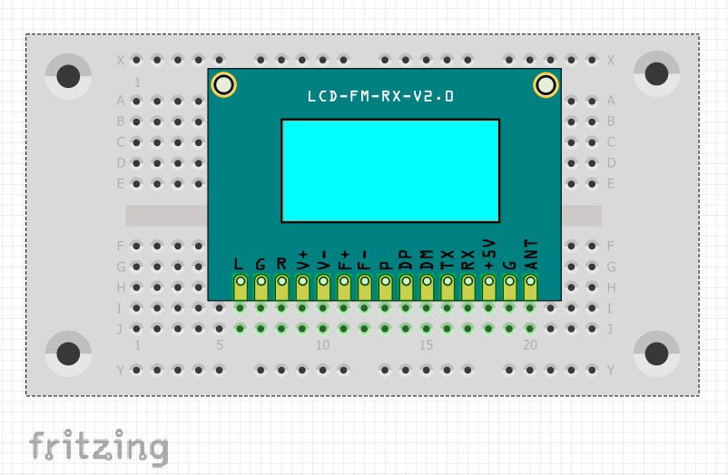
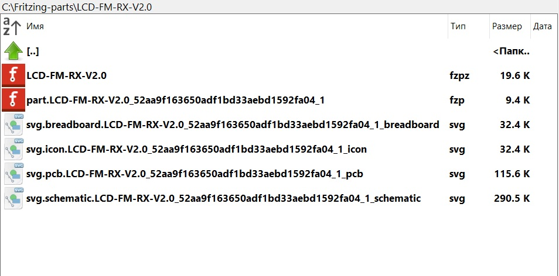

### [Представление детали (компонента) во Fritzing](https://github.com/fritzing/fritzing-app/wiki/2.1-Part-file-format)



Любой компонент Fritzing (деталь) распространяется в виде архивного файла с расширением ***.fzpz***. Внутри архива может находиться до пяти файлов: одного файла метаданных ***.fzp*** и до четырех файлов ***.svg***. 

Каждая деталь может отображаться в четырех разных видах (макет - breadboard, схема - schematic, печатная плата - pcb и значок - icon детали), как правило с разным изображением для каждого вида. Решено не объединять все SVG и метаданные в один файл, потому что их раздельное хранение упрощает совместное использование одного изображения разными деталями (например, многие детали занимают одинаковую площадь печатной платы), а также потому, что хранение SVG в отдельных файлах упрощает доступ к отдельным изображениям, например, для проверки или загрузки в редактор деталей.

В файле метаданных (это файл формата .xml, переименованный в .fzp) перечислены название детали, описание и другие свойства, а также ссылки на SVG-файлы детали. В нем также указаны разъемы детали и внутренние шины. Графическое изображение каждого соединителя (разъёма) представляет собой элемент, найденный в соответствующем файле SVG. Поскольку любой SVG-элемент для Fritzing должен иметь атрибут id, файл метаданных ссылается на графический элемент соединителя, используя id этого элемента.



#### Структура папок во Fritzing

Файлы метаданных для всех деталей, поставляемых с Fritzing, можно найти в ***fritzing-parts*** папке приложения в следующих подпапках:

```
Папка	                Описание
-----------------------------------------------------------------
fritzing-parts/core     файлы метаданных всех деталей в ядре
fritzing-parts/contrib  файлы метаданных всех добавленных деталей 
fritzing-parts/obsolete файлы метаданных устаревших деталей для обратной совместимости
```
В папке ***fritzing-parts/svg*** вы найдете соответствующие подпапки core, contrib и obsolete. Структура подпапки core (базовой библиотеки элементов) выглядит следующим образом:

```
Папка	                            Описание
-----------------------------------------------------------------
fritzing-parts/svg/core/breadboard	SVG-файлы для макетного представления деталей (частей) 
fritzing-parts/svg/core/icon	    SVG-файлы для значков деталей 
fritzing-parts/svg/core/pcb 	    SVG-файлы  для отображения деталей на печатной плате (footprints)
fritzing-parts/svg/core/schematic	SVG-файлы  для схематического представления деталей
```
Структура других подпапок (contrib и obsolete) аналогична подпапке элементов базовой библиотеки (core).

Начиная с версии 0.9.3, папка ***fritzing-parts*** фактически является git-клоном [https://github.com/fritzing/fritzing-parts](https://github.com/fritzing/fritzing-parts). Fritzing проверяет репозиторий github на наличие обновлений при каждом запуске и выполняет "git pull", если пользователь согласен.

Во Fritzing некоторые детали создаются "на лету", а не просто загружаются, например, линейки, резисторы, штыревые головки, типовые углубления (при изменении своих параметров). Шаблоны для этих деталей компилируются вместе с программой.

Детали, которые создаются пользователем, хранятся в пользовательском каталоге (user), чтобы не потеряться при установке новых версий Fritzing. Для Windows эта папка - ***C:/Users/username/Documents/Fritzing/parts***.

При работе приложения создаются некоторые временные файлы, связанные с деталями, которые участвуют в проектирование схемы (модели). Для Windows эти файлы хранятся в папке ***C:/Users/username/AppData/Roaming/Fritzing***.

Файлы проектов - это файлы ***.fzz***. Они размещаются в одноименной папке ***fzz***. Папка ***partfactory*** содержит файлы для созданных деталей, такие как заголовки выводов (пины) и типовые углубления (отверстия).

До версии 0.9.2 здесь также хранились пользовательские детали.

Расположение файла svg любой детали можно узнать открыв её в редакторе деталей. После переключения ***на нужный вид*** (макет - breadboard, схема - schematic, печатная плата - pcb или значок - icon) следует выбрать ***"Показать в папке"*** (Show in folder) в меню Файл.

Базовые детали Fritzing (детали ядра) собираются в базу данных ***Sqlite*** (файл с расширением ***.db***) с использованием данных из файлов fzp. Эта база данных используется для замены деталей (Sqlite обеспечивает быстрый механизм переключения между связанными деталями). Для компиляции базы данных запустите Fritzing из командной строки: ***fritzing.exe -db path/to/parts/parts.db*** или выберите ***"Компонент"*** -> ***"Восстановить базу данных компонентов"*** в меню.

#### [Формат FZP](LCD-FM-RX-V2.0.xml)

Файл метаданных компонента (детали) ***.fzp*** представляет собой xml-файл. 

Самым внешним элементом в файле FZP всегда является тег ***\<module\>***. Важен атрибут ***ModuleID*** - он должен быть уникальным для каждой детали. Fritzing отклонит деталь, если она уже загружена с таким же ModuleID. Атрибут ***fritzingVersion*** указывает какой версией Fritzing был сгенерирован компонент. Для указания атрибута fritzingVersion вручную лучше всего запустить Fritzing и открыть окно "About", из которого вы можете скопировать строку "version". Первая часть строки является наиболее важной: в приведенном выше примере это означает просто “0.3.15b”.
```
<?xml version='1.0' encoding='UTF-8'?>
<module  
  fritzingVersion="0.3.15b.02.03.3943" 
  moduleId="LCD-FM-RX-V2.0_52aa9f163650adf1bd33aebd1592fa04_1"
  referenceFile="GLCD 128x64.fzp">
  
  <author>Vladimir Trufanov</author>
  <title>LCD-FM-RX-V2.0</title>
  <label>LCD-FM-RX-V2.0</label>
  <date>Sun Feb 18 2024</date>
  <description>Модуль цифрового стереорадиоприемника DSP PLL FM Receiver</description>
  <url>https://www.doortry.ru</url>
     
  <tags>
    <tag>FM radio</tag>
  </tags>

  - - - - -
</module>
```
Контекст следующих строк от ***\<author\>*** до ***\</tags\>*** очевиден без комментариев.

Элемент ***\<label\>*** - это строка метки детали по умолчанию, когда она появляется в эскизе Fritzing.

Элемент ***\<description\>*** - краткое описание детали, может быть обычным текстом или в виде форматированного текста - подмножества html, которое может отображаться в определенных виджетах Qt (Qt - базовый графический интерфейс Fritzing). Если используется форматированный текст, он должен быть экранирован для формата xml, чтобы не запутаться в структуре [FZP-файла](LCD-FM-RX-V2.0.xml).

Поисковые теги ***\<tag\>*** позволяют выполнять поиск деталей в корзине компонентов. 

Для устаревших деталей используется специальный синтаксис ***\<version replacedby=""\>***. Значением атрибута replacedby является ModuleID детали, которая заменяет устаревшую деталь. В папках obsolete есть такие компоненты. Атрибут replacedby также может быть применен к отдельным соединителям.

#### Свойства детали

Как пример, ниже представлены свойства потенциометра:

```
<properties>
   <property name="family">             Potentiometer  </property>
   <property name="type">               Trimmer Potentiometer  </property>
   <property name="Maximum Resistance"> 10k&#8486;  </property>
   <property name="Track">              Linear  </property>
   <property name="Size">               Trimmer - 6mm  </property>
</properties>
```
Свойства важны - Fritzing использует их, чтобы упростить переключение между связанными деталями в эскизе. Когда свойства загружены, они сохраняются в базе данных; поиск в этой базе данных дает набор связанных деталей. Наиболее важным свойством является ***"family"*** - Fritzing выполняет замену только между деталями из одного семейства. Если требуется семейное свойство, то Fritzing отклонит детали, у которых нет соответствующего семейного свойства.

Значения других свойств используются для заполнения всплывающих меню в окне инспектора Fritzing. Например, когда вы выбираете потенциометр в эскизе, в окне инспектора появляется всплывающее меню с надписью ***“type”*** с опциями “Trimmer Potentiometer”, “Slide Potentiometer”, или “Rotary Shaft Potentiometer”. Эти значения взяты от разных деталей семейства "Potentiometer"; каждая деталь (компонент) в этом семействе имеет разное значение свойства "type".

Для атрибута свойства ***showInLabel*** может быть установлено значение ***yes*** и это означает, что по умолчанию это свойство должно отображаться в эскизе проекта. Например, резистор:
```
<property name="Resistance" showInLabel="yes">220</property>
 ```
#### Виды и слои

Теги ***"\<views\>"*** указывают на SVG-файлы, используемые компонентом для каждого из четырёх видов: IconView, breadboardView, schematicView и pcbView.
```
<views>
   <iconView>
      <layers image="icon/LCD-FM-RX-V2.0_52aa9f163650adf1bd33aebd1592fa04_1_icon.svg">
         <layer layerId="icon"/>
      </layers>
   </iconView>
   
   <breadboardView>
      <layers image="breadboard/LCD-FM-RX-V2.0_52aa9f163650adf1bd33aebd1592fa04_1_breadboard.svg">
         <layer layerId="breadboard"/>
      </layers>
   </breadboardView>
   
   <schematicView>
      <layers image="schematic/LCD-FM-RX-V2.0_52aa9f163650adf1bd33aebd1592fa04_1_schematic.svg">
         <layer layerId="schematic"/>
      </layers>
   </schematicView>
   
   <pcbView>
      <layers image="pcb/LCD-FM-RX-V2.0_52aa9f163650adf1bd33aebd1592fa04_1_pcb.svg">
         <layer layerId="copper0"/>
         <layer layerId="copper1"/>
         <layer layerId="silkscreen"/>
      </layers>
   </pcbView>
</views>
  
```
Для каждого вида детали обычно используется отдельный SVG-файл. Но помимо этого, каждый вид имеет несколько слоев. Слои имеют определенный уровневый порядок и в пользовательском интерфейсе Fritzing каждый слой может быть видимым или скрытым. 

Изображения деталей во Fritzing могут находиться в различных слоях. Но соединители (разъёмы) могут быть назначены только определенным слоям. Это хорошо видно в слоях печатной платы. Для печатной платы обязательны: copper0, copper1, silkscreen.

Если слой указан в файле FZP, очень важно, чтобы элемент с таким id существовал и в SVG-файле, даже если это всего лишь пустой элемент. 

Во Fritzing по умолчанию компоненты в виде макета и печатной платы нельзя переворачивать, поскольку обычно это плохо согласуется с тем, как ведётся работа с реальными физическими деталями. В отличие от этого, на схеме деталь по умолчанию можно переворачивать всегда. Однако можно включить переворачивание в любом виде компонента для каждой из двух осей по отдельности, установив для соответствующего атрибута переворачивания  flipVertical или flipHorizontal значение “true”.
```
<breadboardView fliphorizontal="true" flipvertical="true" >
```
#### Сквозные отверстия (THT) и поверхностный монтаж деталей (SMD)

Во Fritzing детали со сквозными отверстиями определяют как те, которые используют оба слоя  copper0 и copper1; детали SMD используют только слой copper1. Под "использованием" подразумевается использование компонентов в FZP для \<views\> и \<connectors\>, а также в качестве идентификаторов элементов в соответствующем svg-файле pcb. 

Если SMD-деталь помещается на нижний слой во Fritzing, слой динамически обновляется до copper0. Некоторые старые детали для сквозных отверстий (THT) используют только copper0 слой; теперь это неправильно, однако Fritzing будет обрабатывать эти части так, как если бы были указаны оба слоя: copper0 и copper1.

Важно, чтобы при указании слоев в FZP были указаны соответствующие слои в соответствующем SVG (подробнее об этом ниже).

#### Соединители (connectors)

```
<connectors>

  <connector id="connector0" name="1 ANT" type="male">
  <description>Antenna</description>
    <views>
    <breadboardView>
      <p layer="breadboard" svgId="connector0pin"/>
    </breadboardView>
    <schematicView>
      <p layer="schematic" svgId="connector0pin" terminalId="connector0terminal"/>
    </schematicView>
    <pcbView>
      <p layer="copper0" svgId="connector0pin"/>
      <p layer="copper1" svgId="connector0pin"/>
    </pcbView>
    </views>
  </connector>
  
  <connector id="connector9" name="10 F+" type="male">
    <description>F+</description>
    <views>
    <breadboardView>
      <p layer="breadboard" svgId="connector9pin"/>
    </breadboardView>
    <schematicView>
      <p layer="schematic" svgId="connector9pin" terminalId="connector9terminal"/>
    </schematicView>
    <pcbView>
      <p layer="copper0" svgId="connector9pin"/>
      <p layer="copper1" svgId="connector9pin"/>
    </pcbView>
    </views>
  </connector>
  
<connectors>
```
Тип разъема имеет значение только на макетной плате, где детали с гнездовыми разъемами могут быть напрямую присоединены к деталям с гнездовыми разъемами. На всех остальных видах для подключения разъемов необходимо использовать провода. К деталям с гнездовыми разъемами относятся макетные платы и Arduino, но и подавляющее большинство деталей имеют гнездовые разъемы. 

Тег ***\<description\>*** элемента и ***name*** кажутся самоочевидными. Но важно отметить, что внутри детали атрибуты ***name*** и ***id*** соединителя должны быть уникальными, то есть никакие два соединителя в данной детали не должны иметь одинаковый идентификатор или одно и то же имя.

Каждый соединитель имеет подэлементы, которые ссылаются на определенный вид. Каждый подэлемент имеет атрибут ***layer*** (в настоящее время все компоненты имеют все свои соединители на одном уровне, и маловероятно, что это изменится).

Атрибут ***svgId*** относится к элементу в SVG-файле представленным с соответствующим атрибутом ***id***. Этот элемент определяет форму соединителя и указывает его положение в детали. В приведенном выше примере значение ***“connector0pin”*** для атрибута ***svgId*** в представлении макета относится к элементу в SVG-файле ***LCD-FM-RX-V2.0_52aa9f163650adf1bd33aebd1592fa04_1_breadboard.svg***, который может быть записан, как:

```
<rect id="connector0pin" x="4.793" y="65.307" fill="нет" width="2.989" height="9.442"/>
```

Атрибут ***terminalId*** необязателен. Каждый соединитель занимает определенную область в детали (в приведенном выше примере это прямоугольник), но фактически провод будет присоединен к соединителю в одной точке в пределах области соединителя. Эта точка прикрепления называется ***конечной точкой - terminal point***. 

Конечной точкой по умолчанию является центр области соединителя. Если вам нужна конечная точка в другом месте, атрибут ***terminalId*** указывает на еще один элемент в SVG-файле - ***terminalId="connector0terminal"***:
```
<rect id="connector0terminal" x="4.793" y="74.192" fill="none" width="2.989" height="0.562"/>
```
Если вы используете атрибут ***terminalId*** в вашем файле FZP, убедитесь, что элемент с таким идентификатором действительно существует в соответствующем SVG-файле. Tеоретически можно значение атрибута ***terminalId*** сделать любым, при условии, что с этим идентификатором связан SVG-элемент, но на практике лучше всего использовать имя соединителя, за которым следует постфикс ***“terminal”***.

В устаревшей детали используется атрибут ***replacedby*** для указания на ***ModuleID*** более новой версии детали. Обычно для каждого разъема на устаревшей детали имеется соответствующий разъем на заменяемой детали, и обычно заменяемый разъем имеет тот же идентификатор, что и устаревший разъем, так что программному обеспечению легко поддерживать соединения при замене устаревшей детали. 

Но иногда заменяемый соединитель не имеет того же идентификатора. В этом случае вы можете использовать атрибут ***replacedby*** для устаревшего соединителя, значением которого является либо идентификатор, либо имя заменяемого соединителя:
```
<connector id='connector15' name='D0RX' type='female' replacedby='RX/D0'>
```
#### Гибкие - "резиновые" ножки (необязательные элементы)

В режиме макета ряд деталей имеют резиновые ножки (также называемые сгибаемыми ножками). Во Fritzing гибкие ножки можно растягивать и добавлять точки сгиба. Ножки могут использовать прямые линии или кривые Безье. Со стороны fzp настроить это довольно просто, например, вот один из них ***\<connector\>*** от герконового переключателя:
```
<connector id="connector0" name="pin 1" type="male">
    <description>Pin 1</description>
    <views>
    <breadboardView>
        <p layer="breadboard" svgId="connector0pin" legId="connector0leg"/>
    </breadboardView>
    <schematicView>
        <p layer="schematic" svgId="connector0pin" terminalId="connector0terminal"/>
    </schematicView>
    <pcbView>
        <p layer="copper0" svgId="connector0pin"/>
        <p layer="copper1" svgId="connector0pin"/>
    </pcbView>
    </views>
</connector>
```
Обратите внимание на атрибут legId: ***legId="connector0leg"*** в элементе breadboardView \<layer\>, что указывает сгибаемые ножки соединения. Понятно, что в SVG макета должен быть соответствующий элемент с ***id="connector0leg"*** для геркона. Этим элементом всегда должен быть ***\<line\>***. Из двух конечных точек линии та, которая ближе всего к центру детали, рассматривается как прикрепленный конец провода. Другой конец линии - тот, который можно перетащить. Вот соответствующая ветвь от герконового переключателя (для дополнительной информации добавлен сам разъём ***\<rect\>***):
```
<rect id="connector0pin" x="0" y="2.937" fill="none" width="1" height="1"/>
<line id="connector0leg" stroke-linecap="round" x1="0" y1="4.062" x2="3" y2="4.062" stroke="#6D6D6D" fill="none" stroke-width="2.5"/>
```
Это своего рода искусство - красиво расположить \<line\> элемент ножки по отношению к соединительному \<rect\> элементу. Существует вариант ножки, используемый рядом деталей, таких как конденсаторы и светодиоды, в котором ножка выходит за пределы корпуса детали. Хитрость здесь в том, чтобы установить перетаскиваемую конечную точку строки за пределами поля просмотра, которое определяет остальную часть детали, как показано в следующем фрагменте SVG-файла для конденсатора:
```
<svg  width="0.243056in" height="0.400278in" viewBox="0 0 17.5 28.82" >
<g id="breadboard">
    <rect id="connector0pin" x="4.292" y="27.82" fill="none" width="2.083" height="1"/>
    <rect id="connector1pin" x="11.365" y="27.82" fill="none" width="2.275" height="1"/>
    <line id="connector0leg" stroke-linecap="round" x1="5.332" y1="28.82" x2="5.332" y2="49.0" stroke="#8C8C8C" fill="none" stroke-width="2.146" />
    <line id="connector1leg" stroke-linecap="round" x1="12.502" y1="28.82" x2="12.502" y2="49.0" stroke="#8C8C8C" fill="none" stroke-width="2.346" />
```
Здесь в примере координата y2 для каждой строки выходит за нижнюю границу окна просмотра на отметке 28.82.

#### Гибридные соединители (необязательные элементы)

Гибридным называется соединитель, который не всегда виден. Например, есть ряд деталей, у которых в режиме макета есть области прототипирования, которые не видны в других режимах. Таких деталей несколько - в основном ***Sparkfun shields*** - которые поставляются с Fritzing. 

Другое применение - для плат, которые имеют внутренние соединения между разъемами, где требуется только одна ссылка на схематическом виде (например, ***GND***). 

Третий случай - это плата, на которой есть разъемы для подключения коллекторов как сверху, так и снизу. На виде печатной платы должны быть показаны нижние разъемы, но не верхние.

В каждой из этих ситуаций для определения соединителя необходимо установить ***hybrid*** атрибут равным ***'yes'*** для каждого представления, где конкретный соединитель ***НЕ*** должен отображаться. Слой, указанный в записи ***hybrid***, должен быть таким же, какой использовался бы для негибридного соединителя. То есть слой должен быть определен в \<views\> и это должен быть слой, содержащий соединители. Не используйте ***silkscreen*** или необычное название слоя, чтобы попытаться отделить контакты гибридного разъема от остальных графических элементов соединительных контактов.
```
<connector id='connector98' type='female' name='5V@1'>
<description>5V@1</description>
    <views>
        <breadboardView>
            <p layer='breadboard' svgId='connector98pin' />
        </breadboardView>
        <schematicView>
            <p layer='schematic' svgId='connector98pin' terminalId='connector98terminal' hybrid='yes' />
        </schematicView>
        <pcbView>
            <p layer='copper0' svgId='connector98pad' hybrid='yes' />
            <p layer='copper1' svgId='connector98pad' hybrid='yes' />
        </pcbView>
    </views>
```
Гибридный разъем не будет выбираться, и к нему не будут подведены никакие провода в отмеченном представлении. Чтобы сделать соединитель полностью невидимым, svg-элементы, указанные атрибутами ***xxxId***, должны быть невидимыми. Для этого установите значения атрибутов заливки и обводки элемента равными ***"none"***. 

Это один из случаев, когда недостаточно установить значения атрибутов для элемента-оболочки (родительского или предкового). Атрибуты необходимо устанавливать непосредственно для элементов с атрибутом ***id***, которые соответствует ***svgId*** или ***terminalId*** из определения соединителя. Можно использовать либо отдельные атрибуты ***"заливка"*** и ***"обводка"***, либо их можно комбинировать с помощью атрибута ***"стиль" (style="fill:none;stroke:none")***.

Поскольку разъемы в любом случае невидимы, их можно исключить как из файлов определения, так и из файлов изображений svg. Для согласованности с другими соединителями в тех же файлах их можно оставить, при условии, что значения svg-заливки и обводки установлены правильно.

Невидимые соединительные элементы могут быть расположены в любом месте (в зависимости от координат) в пределах изображения. Все они могут быть размещены в одних и тех же координатах без проблем с перекрывающимися проводами. К ним никогда не подключается провод, поэтому нечему мешать.

Недостаточно сделать видимые графические элементы невидимыми и/или переместить их за пределы обычного слоя (групп). Это приводит к появлению фиктивных строк в файле компонента.

Для деталей, у которых нет схемы или содержимого для просмотра печатной платы, этот метод работает не совсем так, как хотелось бы. Пустая деталь и (изначально) ее метка детали все еще видны на видах, даже несмотря на отсутствие разъемов. Единственный способ обойти это, состоит в том, чтобы определить деталь как принадлежащую к семейству макетов - "breadboard".

#### Внутренние подключения (необязательные элементы)

Шина во Fritzing - это то, что называется внутренним соединением между разъемами. Макетные платы и ленточные платы широко используют шины (а с помощью ленточных плат пользователь может динамически изменять структуру шины). 

Ряд других деталей поставляется с шинами, в первую очередь с GND и различными выводами ICSP на различных Arduino, но также и, например, с 4-контактной кнопкой. В редакторе деталей есть режим ***"показать внутренние соединения"***, который позволяет визуализировать и редактировать шины, рассматривая каждую из них как провод. Далее показан раздел шин для 4-контактной кнопки, где описаны две отдельные шины:
```
<buses>
    <bus id="bus0" >
        <nodeMember connectorId="connector0" />
        <nodeMember connectorId="connector1" />
    </bus>
    <bus id="bus1" >
        <nodeMember connectorId="connector2" />
        <nodeMember connectorId="connector3" />
    </bus>
</buses>
```
Атрибут ***connectorId*** относится к атрибуту ***id*** соединителя в \<connectors\> элементе. Имена шин могут быть произвольными, при условии, что каждое имя шины уникально в пределах данной детали (т. е. в файле fzp).

### Библиография

### [Part file format - https://github.com/fritzing/fritzing-app/wiki/2.1-Part-file-format](https://github.com/fritzing/fritzing-app/wiki/2.1-Part-file-format) 