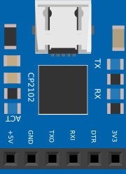
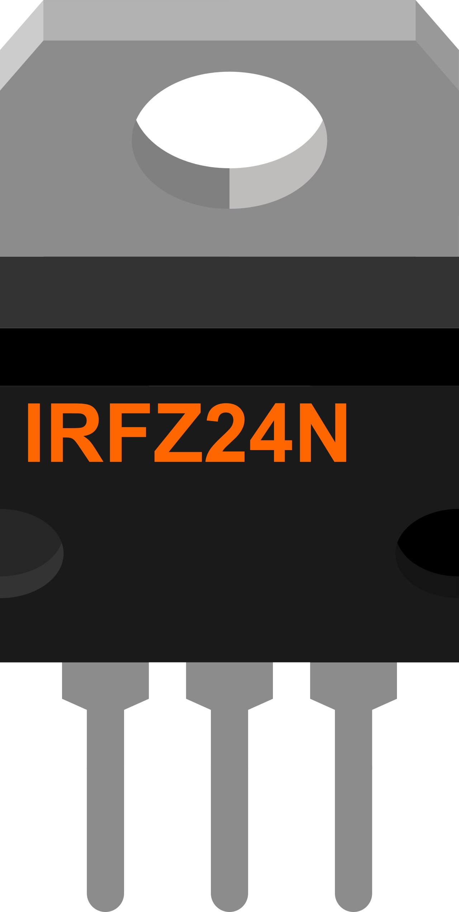
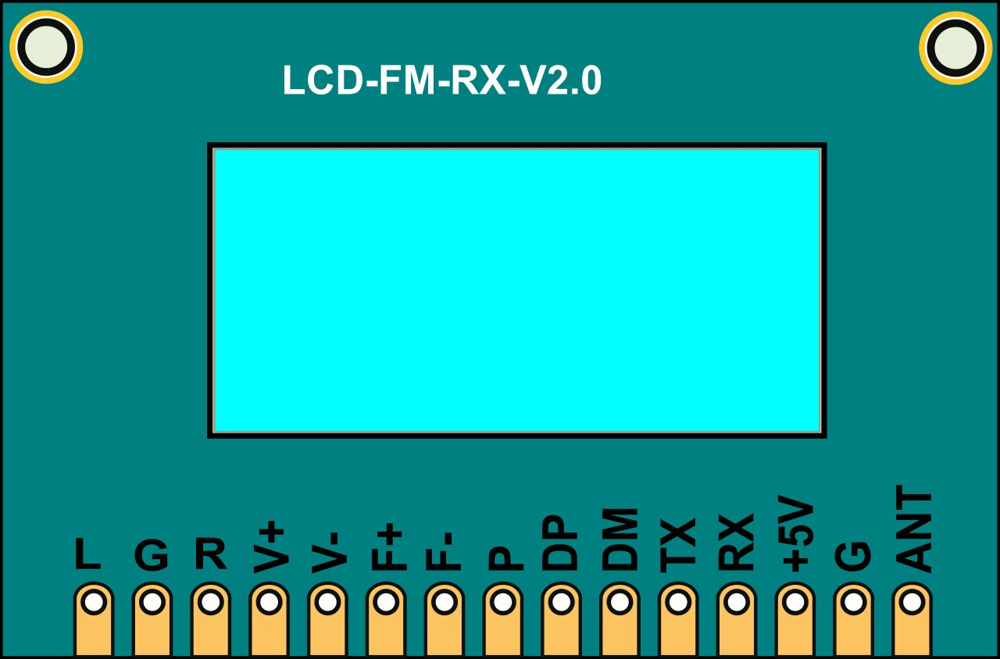

### [Рабочие компоненты для Fritzing - tve_parts]()

В данном материале представлены компоненты (детали) для использования в проектах Fritzing. Детали были пересобраны из других компонентов или построены с нуля. Список рабочих компонентов изложен в алфавитном порядке:


#### [Battery3AA-A - батарея из трех элемeнтов AAA или AA](#battery3aa-a---%D0%B1%D0%B0%D1%82%D0%B0%D1%80%D0%B5%D1%8F-%D0%B8%D0%B7-%D1%82%D1%80%D0%B5%D1%85-%D1%8D%D0%BB%D0%B5%D0%BC%D0%B5%D0%BD%D1%82%D0%BE%D0%B2-aaa-%D0%B8%D0%BB%D0%B8-aa)

#### [CP2102 USB UART - прoграмматор плат Arduino](#cp2102-usb-uart---%D0%BF%D1%80%D0%BE%D0%B3%D1%80%D0%B0%D0%BC%D0%BC%D0%B0%D1%82%D0%BE%D1%80-%D0%BF%D0%BB%D0%B0%D1%82-arduino)

#### [IRFZ24N - пoлевой транзистор](#irfz24n---%D0%BF%D0%BE%D0%BB%D0%B5%D0%B2%D0%BE%D0%B9-%D1%82%D1%80%D0%B0%D0%BD%D0%B7%D0%B8%D1%81%D1%82%D0%BE%D1%80)

#### [LCD-FM-RX-V2.0 - мoдуль FM радиоприемника DSP PLL 87-108 МГц](#lcd-fm-rx-v2.0---%D0%BC%D0%BE%D0%B4%D1%83%D0%BB%D1%8C-fm-%D1%80%D0%B0%D0%B4%D0%B8%D0%BE%D0%BF%D1%80%D0%B8%D0%B5%D0%BC%D0%BD%D0%B8%D0%BA%D0%B0-dsp-pll-87-108-%D0%BC%D0%B3%D1%86)

#### [USB-TTL UART преoбразователь для программирования контроллеров](#usb-ttl-uart-%D0%BF%D1%80%D0%B5%D0%BE%D0%B1%D1%80%D0%B0%D0%B7%D0%BE%D0%B2%D0%B0%D1%82%D0%B5%D0%BB%D1%8C-%D0%B4%D0%BB%D1%8F-%D0%BF%D1%80%D0%BE%D0%B3%D1%80%D0%B0%D0%BC%D0%BC%D0%B8%D1%80%D0%BE%D0%B2%D0%B0%D0%BD%D0%B8%D1%8F-%D0%BA%D0%BE%D0%BD%D1%82%D1%80%D0%BE%D0%BB%D0%BB%D0%B5%D1%80%D0%BE%D0%B2)

---

### [Battery3AA-A - батарея из трех элементов AAA или AA](#cp2102-usb-uart---%D0%BF%D1%80%D0%BE%D0%B3%D1%80%D0%B0%D0%BC%D0%BC%D0%B0%D1%82%D0%BE%D1%80-%D0%BF%D0%BB%D0%B0%D1%82-arduino)

Батарея/блок из трех элементов/аккумуляторов с форм-факторами AA или AAA - могут быть солевыми, щелочными, литиевыми. 

***Солевые***. Это самый старый тип, впервые был сконструирован в 1907 году. Состоят из цинка, диоксида марганца и соли аммония, которая выступает в качестве электролита. Их плюс это относительно небольшой вес и низкая цена. Однако они плохо себя показываю при низких температурах, имеют склонность к саморазряду (по мере хранения теряют заряд), а энергоемкость у них самая низкая. Но это неплохой вариант для разового использования.

***Щелочные (алкалиновые)***. Устроены аналогично солевым, но в качестве электролита тут выступает раствор щелочи (используется гидроксид калия). Саморазряд у них значительно меньше, при низких температурах они работаю лучше, энергоемкость значительно выше. Но они немного тяжелее и стоят дороже. 

***Литиевые***. Могут быть разных типов, в плане состава электролита и минусового реагента, но для плюсового всегда будет использоваться литий. Это самый дорогой тип элементов. Но зато у них практически нет саморазряда, энергоемкость самая высокая, что и является ключевым преимуществом. 

#### Характеристики:

"***Пальчиковые***" - ***АА*** (самые распространенные в мире) имеют длину 50 мм и диаметр 14, "***мизинчиковые***" - ***ААA*** имеют длину 44.6 и диаметр 10.5 миллиметров.

Обычная усреднённая емкость для элементов ***АА*** составляет: солевые – 1000 мАч, щелочные – 1500 мАч, литиевые – 1250 мАч. 

Для элементов ***AAA*** соответственно: солевые – 500, щелочные – 750, литиевые – 1200. 

По сроку хранения -  солевые допустимо хранить максимум до трех лет (с момента производства), щелочные до пяти, а литиевые до 12 лет, реже больше.

***Пальчиковые аккумуляторы*** делят на литиевые (до 3000 мАч), щелочные (до 2800 мАч) и солевые (до 1500 мАч). Еще есть никель-кадмиевые, никель-цинковые и никель-металлгидридные.


###### [в начало](#%D1%80%D0%B0%D0%B1%D0%BE%D1%87%D0%B8%D0%B5-%D0%BA%D0%BE%D0%BC%D0%BF%D0%BE%D0%BD%D0%B5%D0%BD%D1%82%D1%8B-%D0%B4%D0%BB%D1%8F-fritzing---tve_parts)
---

### [CP2102 USB UART - программатор плат Arduino](https://github.com/Vladimir-Trufanov/Fritzing-parts/blob/main/tve_parts/CP2102%20USB%20UART.fzpz)

Устройство используется, как программатор некоторых плат Arduino, и является модификацией [USB-TTL UART](#usb-ttl-uart) с тем же функционалом, но изменённым типом и расположением контактов.

Характеристики:
```
Скорость обмена данными по UART         300 бит/сек — 1 Мбит/сек
Буферы:                                 чтения 576 байт, записи 640 байт
Поддержка USB 2.0                       12Мбит/сек
Встроенный стабилизатор питания         3.3В 100мА
EEPROM с конфигурационными параметрами  1024 байт
```



###### [в начало](#%D1%80%D0%B0%D0%B1%D0%BE%D1%87%D0%B8%D0%B5-%D0%BA%D0%BE%D0%BC%D0%BF%D0%BE%D0%BD%D0%B5%D0%BD%D1%82%D1%8B-%D0%B4%D0%BB%D1%8F-fritzing---tve_parts)
---

### [IRFZ24N - полевой транзистор](https://github.com/Vladimir-Trufanov/Fritzing-parts/blob/main/tve_parts/IRFZ24N.fzpz)

***IRFZ24N*** является мощным n-канальным МОП (MOSFET) транзистором.

```
Максимальное напряжение сток-исток (Uси):    55В;
Максимальный продолжительный ток стока (Iс): 17А;
Максимальный импульсный ток стока (Iс):      68А;
Сопротивление открытого канала (Rси):        70мOм (0.07Ом);
Пороговое напряжение затвор-исток (UGS):     2... 4В;
Максимальное напряжение затвор-исток (Uзи):  ±20В;
Корпус:                                      ТО-220;
```


###### [в начало](#%D1%80%D0%B0%D0%B1%D0%BE%D1%87%D0%B8%D0%B5-%D0%BA%D0%BE%D0%BC%D0%BF%D0%BE%D0%BD%D0%B5%D0%BD%D1%82%D1%8B-%D0%B4%D0%BB%D1%8F-fritzing---tve_parts)
---

### [LCD-FM-RX-V2.0 - модуль FM радиоприемника DSP PLL 87-108 МГц](https://github.com/Vladimir-Trufanov/Fritzing-parts/blob/main/tve_parts/LCD-FM-RX-V2.0.fzpz)

Модуль радиоприемника DSP PLL 87-108 МГц использует передовую технологию цифровой обработки аудиосигнала (DSP) и FM-модуляцию с фазовой автоподстройкой (PLL) для придания звуку большей реалистичности, более стабильных характеристик, длительного времени работы без смещения частоты.

ЖК-дисплей устройства с минимальным объёмом информации, но интуитивно понятен и точен, с очень низким энергопотреблением  и минимальными шумовыми помехами.

Поддержка последовательных команд AT позволяет хорошо реализовать программное управление радиоприемником.

Стабилизация частоты кварцевого кристалла обеспечивает устойчивое удержание частоты при изменение температуры.

Параметры продукта:

```
Выходная мощность:           500 МВт (проводные наушники)
Диапазон частот:             50 Гц-18 кГц
Канал:                       стерео
Эквивалентный уровень шума:  ≥30 дБ
Напряжение питания:          3,0 В-5,0 В
Ток:                         40 мА
```



###### [в начало](#%D1%80%D0%B0%D0%B1%D0%BE%D1%87%D0%B8%D0%B5-%D0%BA%D0%BE%D0%BC%D0%BF%D0%BE%D0%BD%D0%B5%D0%BD%D1%82%D1%8B-%D0%B4%D0%BB%D1%8F-fritzing---tve_parts)
---

### [USB-TTL UART преобразователь для программирования контроллеров](https://github.com/Vladimir-Trufanov/Fritzing-parts/blob/main/tve_parts/USB-TTL%20UART.fzpz)

USB-UART преобразователь предназначен для программирования ***Arduino Pro Mini*** и других контроллеров, а также позволяет получать информацию на компьютер со всего, что имеет последовательный интерфейс с TTL логикой. 

Адаптер представляет из себя плату без корпуса на которой распаян чип CP2102 с небольшой обвязкой. С одной стороны находиться разъём USB, с другой 6 pin выводов: +3.3v, GND, +5v, TXD (TX), RXD (RX), DTR. На плате имеются монтажные отверстия с функциями DCD, D3R, RTS, CTS, SUS, SUS, R1, RST и 3 светодиода: первый - POWER (светится при подключении питания) и два для RX и TX (мигают во время приема-передачи данных).

Важная особенность в наличии вывода DTR, который можно напрямую подключить к входу RESET на контроллере не имеющем USB на плате (Arduino Pro Mini), что позволяет не нажимать RESET при программировании этого устройства.

Аналогичное устройство для программирования -  [CP2102 USB UART](#cp2102-usb-uart---%D0%BF%D1%80%D0%BE%D0%B3%D1%80%D0%B0%D0%BC%D0%BC%D0%B0%D1%82%D0%BE%D1%80-%D0%BF%D0%BB%D0%B0%D1%82-arduino).


###### [в начало](#%D1%80%D0%B0%D0%B1%D0%BE%D1%87%D0%B8%D0%B5-%D0%BA%D0%BE%D0%BC%D0%BF%D0%BE%D0%BD%D0%B5%D0%BD%D1%82%D1%8B-%D0%B4%D0%BB%D1%8F-fritzing---tve_parts)


